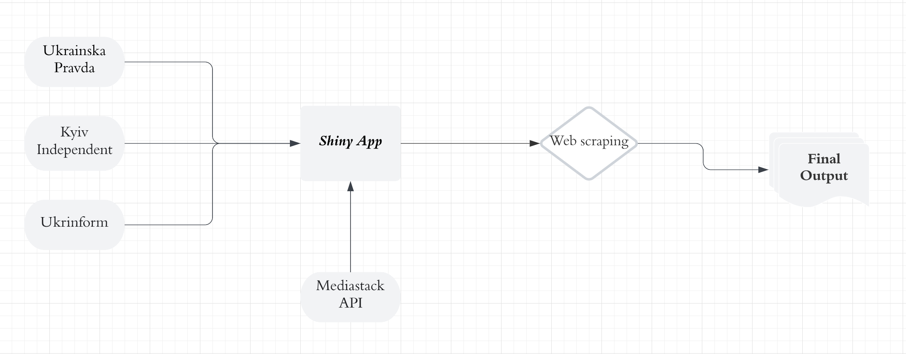

# NAV_Capstone

### Proposed TODOs:

#### 1. Learn how to _actually_ use github. No more "Add files via upload" :) Either: 
- [x] Learn how to use GitHub Desktop - great GUI interface
- [ ] Learn how to use git from command line

#### 2. Improve GitHub
- [x] Determine what files are needed in GitHub
  - [x] Remove unneeded files
- [x] Create listing of files with descriptions

```
.
├── .gitignore
├── README.md
├── app.py: main driver application
├── final_df.csv: final output of the model combining all the websites scraped 
├── get_category.py: logic for assigning category scores
├── get_date.py: logic for assigning dates
├── get_location.py: logic for assigning locations
├── get_sub_category.py: logic for assigning sub-category scores
├── kws.csv: keywords categories list along with its assigned scores
├── manifest.json: information about the application, its dependencies, and associated files
├── master_urls_independent.csv: list of urls scraped for this website.
├── master_urls_inform.csv: list of urls scraped for this website.
├── master_urls_inform.xlsx: list of urls scraped for this website.
├── requirements.txt: information about all the libraries, modules, and packages
├── rsconnect-python
│   └── kinetic.json: contains information about a Shiny app
├── sub_kws.csv: sub-category keywords list along with its assigned scores
├── total_independent.csv: model output for Kyiv Independent website scraped.
├── total_inform.csv: model output for Ukrinform website scraped.
└── total_pravda.csv: model output for Ukrainska Pravada website scraped.

```
- [x] Create diagram of how app functions and code works together


   


- [ ] Create technical instructions for future groups 

#### 3. Improve existing code
- [ ] Annotate code:
  - [ ] Add official doc strings to modules, classes, and functions: https://sphinx-rtd-tutorial.readthedocs.io/en/latest/docstrings.html
  - [ ] Add in line comments to other parts of code
- [ ] Figure out a way to test simpler runs that don't take so long.
- [ ] Make code more robust to failures with try/except logic
- [ ] Reduce code repetition by creating functions and external files for key words, etc.
- [ ] **(optional)** Add logging and messages so you know what is happening in the code while it is running
- [ ] **(optional)** Reduce requirements.txt

#### 4. Add API branch
- [x] Sign up for Mediastack API 
- [ ] Add branch for social in Shiny UI and `app.py`
- [ ] **(optional)** Twitter?

#### 5. Improve Usability
- [ ] Improve non-technical user documentation and instructions
- [ ] Test until the program runs or fails gracefully in all reasonable scenarios
